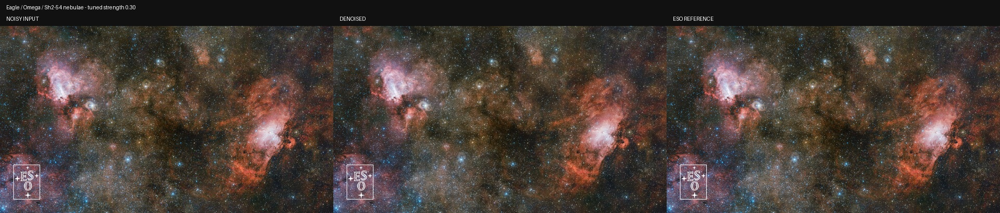
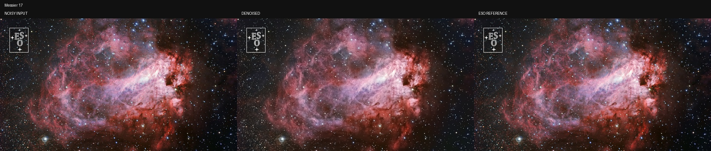
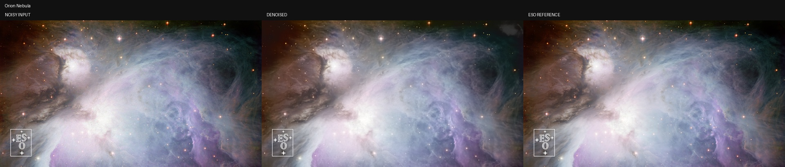

# 1080P 在线天文图片测试报告

测试日期：2026-09-01。目标是验证 `StarDenoise` 在真正的 1920×1080 图像上能否完整运行，并观察不同天文内容对降噪强度的敏感性。

## 测试图片与授权

三张图都从欧洲南方天文台（ESO）官方下载，文件经 Pillow 验证为 `1920×1080 RGB`。

| 测试图 | ESO 页面 | 下载文件 | 署名 |
|---|---|---|---|
| Eagle / Omega / Sh2-54 三大星云全景 | [vbg_011](https://www.eso.org/public/products/virtualbackgrounds/vbg_011/) | `inputs_1080p/references/vbg_011_nebulae.jpg` | ESO |
| M17 恒星形成区 | [vbg_012](https://www.eso.org/public/products/virtualbackgrounds/vbg_012/) | `inputs_1080p/references/vbg_012_messier17.jpg` | ESO |
| 猎户座星云 | [vbg_013](https://www.eso.org/public/products/virtualbackgrounds/vbg_013/) | `inputs_1080p/references/vbg_013_orion.jpg` | ESO/Igor Chekalin |

除非页面另有说明，ESO 公共图片采用 [Creative Commons Attribution 4.0](https://www.eso.org/public/outreach/copyright/)；再发布图片或本报告中的对比图时必须保留上表完整署名。图中的 ESO 水印来自官方原图，本测试没有移除。

## 为什么添加可控噪声

ESO 发布图片已经经过校准、叠加和后期处理，本身接近低噪成片。如果直接对低噪图运行模型，只能看到轻微平滑，无法客观判断去噪正确性。

因此测试保留下载图作为 reference，并用固定随机种子生成真实感更接近传感器的测试输入：

```text
shot noise  = Poisson(reference × 350) / 350
read noise  = Normal(0, 0.010)
row pattern = 每行每通道 Normal(0, 0.003)
noisy       = clip(shot + read + row pattern, 0, 1)
```

生成的 `inputs_1080p/noisy/*.png` 仍然是 1920×1080。脚本保存 noisy PNG 后会重新读取该文件，再送入模型；输出 PNG 也重新读取后才计算指标，所以报告数字与交付文件完全一致。

## 统一测试参数

```text
model           Cosmic Clarity AI 3.6 PyTorch
device          CPU / torch 2.13.0+cpu
resolution      1920×1080 RGB
tile            256×256
overlap         64
mode            full（亮度 AI + 引导色度滤波）
strength        0.85
color-strength  0.75
precision       FP32
linear-stretch  never（输入已经拉伸）
```

运行：

```powershell
cd D:\Workman\MyProject\ImageStack\AstroColorProcess\StarDenoise
conda activate study
python benchmark_1080p.py
```

## 严格落盘结果

| 图片 | CPU 耗时 | 输入 PSNR | 输出 PSNR | 输入 SSIM | 输出 SSIM | 输入 MAE | 输出 MAE | 结论 |
|---|---:|---:|---:|---:|---:|---:|---:|---|
| 三大星云全景 | 52.980 s | 30.603 | 27.274 | 0.89247 | 0.78516 | 0.022849 | 0.030590 | **0.85 过强，真实密集星点被平滑** |
| M17 | 57.588 s | 30.724 | 30.781 | 0.75422 | 0.88554 | 0.021921 | 0.017849 | PSNR基本持平，结构和绝对误差改善 |
| 猎户座星云 | 59.533 s | 28.392 | **34.168** | 0.50262 | **0.91295** | 0.029182 | **0.011197** | **明显有效** |

平均 CPU 时间约 56.7 秒/张；输出尺寸全部保持 1920×1080，未发现 tile seam。

## 密集星野的低强度复测

三大星云全景包含极密集星点和大量细碎高频结构。统一的 `strength=0.85` 会把一部分真实结构识别成噪声，因此使用同一个 `denoise.py` 精确重跑：

```powershell
python denoise.py `
  inputs_1080p\noisy\vbg_011_nebulae_noisy.png `
  outputs_1080p\vbg_011_nebulae_denoised_strength030.png `
  --device cpu --strength 0.30 --color-strength 0.25 --mode full `
  --tile-size 256 --overlap 64 --precision fp32 --linear-stretch never
```

| 三大星云全景 | PSNR | SSIM | MAE | CPU 时间 |
|---|---:|---:|---:|---:|
| 带噪输入 | 30.603 | 0.89247 | 0.022849 | — |
| strength=0.85 | 27.274 | 0.78516 | 0.030590 | 52.980 s |
| **strength=0.30** | **32.300** | **0.92579** | **0.018252** | 51.126 s |

这说明失败原因不是分辨率或 tile 推理错误，而是降噪强度与内容不匹配。网络计算量基本与 strength 无关，所以低强度不会显著加速；它只是把更多原始细节混回输出。

## 对比图

每张图从左到右都是：带噪输入、模型输出、ESO reference。

### 三大星云全景——调优后 strength=0.30



### M17——strength=0.85



### 猎户座星云——strength=0.85



## 结论

1. 当前代码可以稳定处理 1920×1080 RGB 图片，输出尺寸正确且无明显分块接缝。
2. 对猎户座这种大面积弥散结构，`0.8～0.9` 强度效果很好。
3. 对 M17 这类星点与星云混合画面，强降噪会改善背景/结构一致性，但 PSNR不一定大幅增加，建议从 `0.5～0.7` 开始。
4. 对极密集星野，建议 `0.25～0.40`；本次 `0.30` 明显优于 `0.85`。
5. 仅以缩略图判断容易忽略被删除的弱星。产品化时应加入星点密度/高频能量检测，自动限制 strength，并提供 100% 局部预览。
6. 本测试是受控合成噪声 benchmark，不等价于相机 raw/FITS 物理验证。正式使用仍应测试真实短曝光与长曝光 stack pair、星点 flux 和 FWHM。

完整机器可读数据位于 `outputs_1080p/benchmark_results.json`，测试脚本为 `benchmark_1080p.py`。

